# BiddingGo 

 

 

# Bidding mate

<table>
  
  <tr>
    <th>김진혁</th>
    <th>박선우</th>
    <th>윤정윤</th>
    <th>이민경</th>
    <th>이애은</th>
    <th>한규진
  </tr>
  
 <tr>

  <td align="center"></td>
  <td align="center"></td>   
  <td align="center"></td>   
  <td align="center">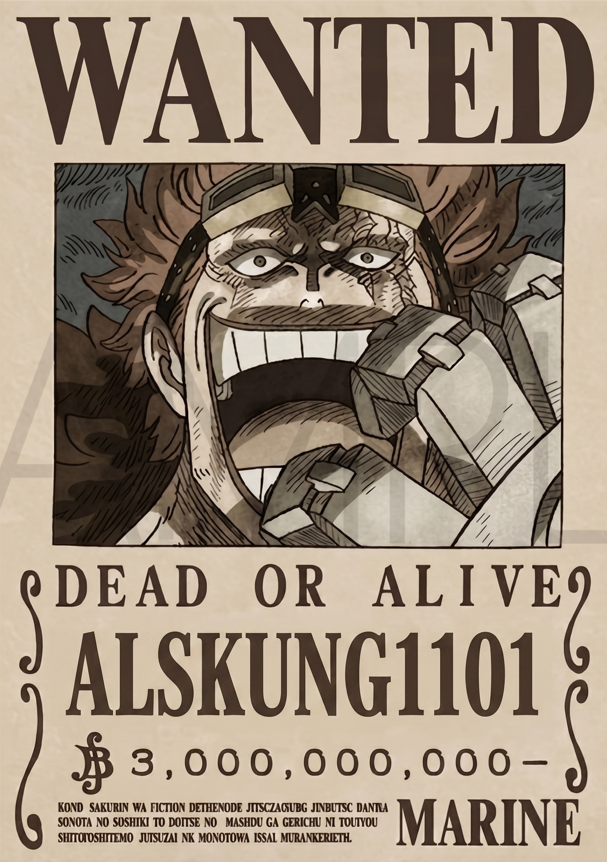</td>  
  <td align="center"></td>   
  <td align="center"></td>  

</tr>

  <tr>
    <td align="center">
      
    </td> 
    <td align="center">
      
    </td>
    <td align="center">
      
    </td>
    <td align="center">
      
    </td>
    <td align="center">
      
    </td>
    <td align="center">
      
    </td>
  </tr>
</table>
    
---

# 목차
 

1. [화면 및 기능 설계서](#1--화면-및-기능-설계서)
2. [테스트 결과 보고서](#2--테스트-결과-보고서)
3. [시연](#3--시연)
4. [회고](#4--회고)

---

# 1.  화면 및 기능 설계서

  
화면 및 기능 설계서 상세보기

  
   
   
  🔗 <a href="https://www.figma.com/design/0dOGV93f5reRfWgJiv1rBH/Biddinggo?node-id=185-1330&t=DaXBKBPbxL8Q8Hgr-1">화면 및 기능 설계서 [Figma 링크]</a>

 

---

# 2.  테스트 결과 보고서

  
테스트 결과 보고서 상세보기

  

  
   
   
    🔗 <a href="https://www.figma.com/design/0dOGV93f5reRfWgJiv1rBH/Biddinggo?node-id=185-1330&t=DaXBKBPbxL8Q8Hgr-1">테스트 결과 보고서 [스프레드 시트]</a>

  

---

# 3.  시연

  
시연 상세보기

   

  

    
회원가입

    <ul>
       
      <li>최초 소셜 로그인 시 회원가입 화면이 표시되며 필수 정보를 입력하면 회원가입이 완료됩니다.</li>
    </ul>
    

      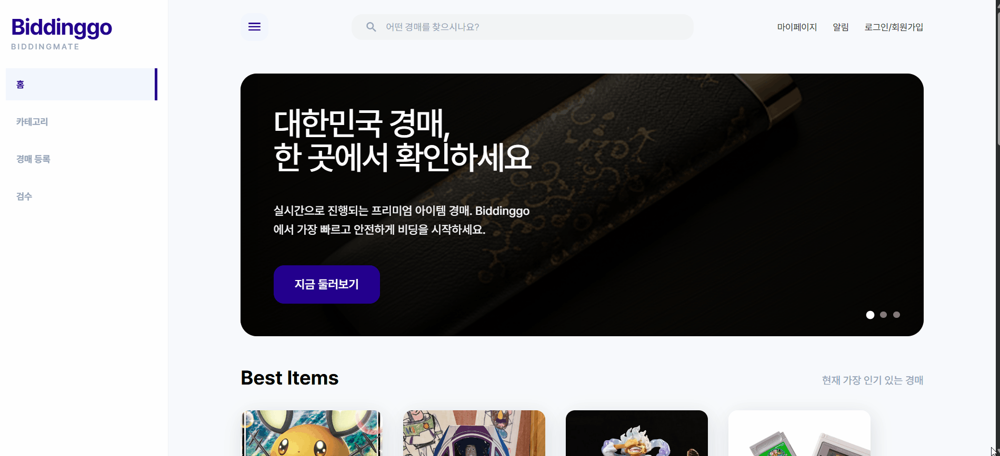
    

  

  

    
로그인

    <ul>
       
      <li>등록된 계정으로 간편하게 로그인합니다.</li>
    </ul>
    

      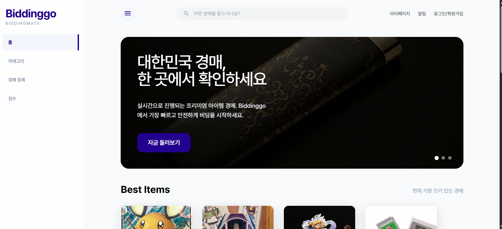
    

  

  

    
로그아웃

    <ul>
       
      <li>현재 세션을 종료하고 안전하게 로그아웃합니다.</li>
    </ul>
    

      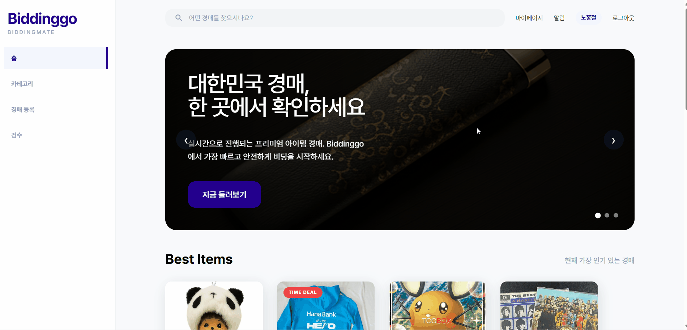
    

  

  

    
홈 화면

    <ul>
       
      <li>메인 배너를 통해 서비스의 특징을 파악하고 실시간으로 업데이트되는 인기 경매 물품 목록을 확인합니다.</li>
    </ul>
    

      
    

  

   

    
일반 경매 등록

    <ul>
       
      <li>매자가 상품 정보와 시작가 여유 있는 마감 기한을 설정하여 기본적인 경매 물품으로 등록합니다.</li>
    </ul>
    

      
    

  

   

    
타임딜 경매 등록

    <ul>
       
      <li>단시간 내에 종료되는 전략적인 경매를 위해 짧은 마감 시간을 설정한 타임딜 상품을 등록합니다.</li>
    </ul>
    

      
    

  

   

    
연장 경매 등록

    <ul>
       
      <li>경매 등록 시 '연장 경매' 옵션을 선택하여 마감 직전 입찰 시 시간이 자동으로 연장되는 상품을 생성합니다.</li>
    </ul>
    

      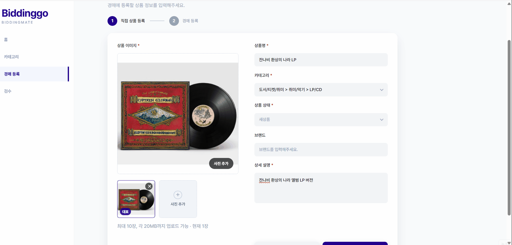
    

  

  

    
연장 경매

    <ul>
       
      <li>경매 종료 1분 전 입찰이 발생하면 마감 시간이 자동으로 3분 연장되어 치열한 입찰 경쟁이 유지되는 로직을 확인합니다.</li>
    </ul>
    

      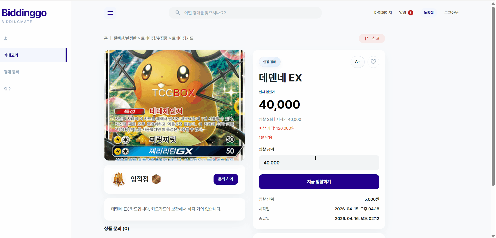
    

  

   

    
검수 신청

    <ul>
       
      <li>사전 검수 상품 등록을 위해 검수 서비스를 신청합니다.</li>
    </ul>
    

      
    

  

  

    
검수 배송 정보 등록

    <ul>
       
      <li>판매자가 검수를 위해 물품을 지정된 주소로 관리자에게 발송합니다.</li>
    </ul>
    

      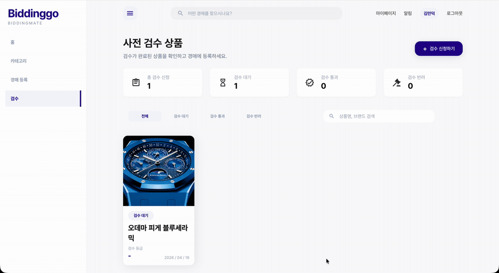
    

  

  

    
검수 승인 [관리자]

    <ul>
       
      <li>검수 결과가 적합한 상품에 대해 승인을 처리합니다.</li>
    </ul>
    

      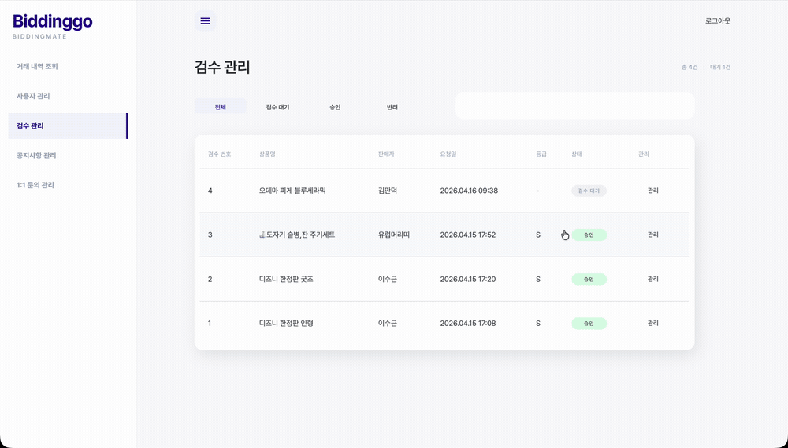
    

  

  

    
검수 반려 [관리자]

    <ul>
       
      <li>상품 정보가 부적합하거나 검수 기준 미달 시 요청을 거절합니다.</li>
    </ul>
    

      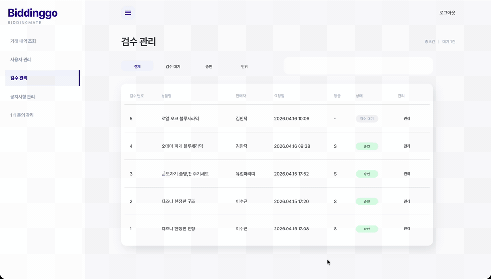
    

  

   

    
검수 반려 확인

    <ul>
       
      <li>검수 반려 이후 반려된 상품의 현재 상태를 확인합니다.</li>
    </ul>
    

      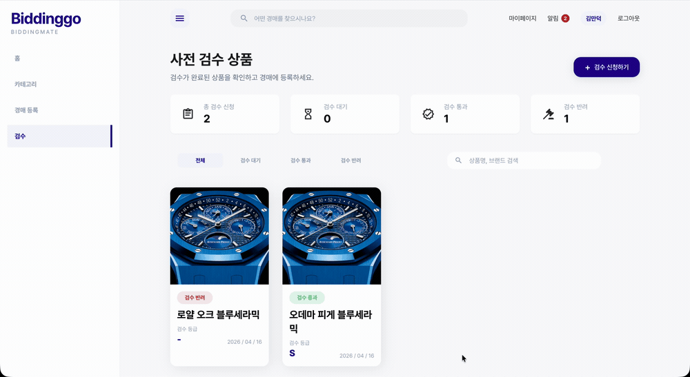
    

  

   

    
신고 및 자동 정지 시스템

    <ul>
       
      <li>부적절한 활동으로 누적 신고 10회 초과 시 해당 사용자의 계정이 자동으로 정지되어 서비스 이용이 제한되는 보호 로직을 확인합니다.</li>
    </ul>
    

      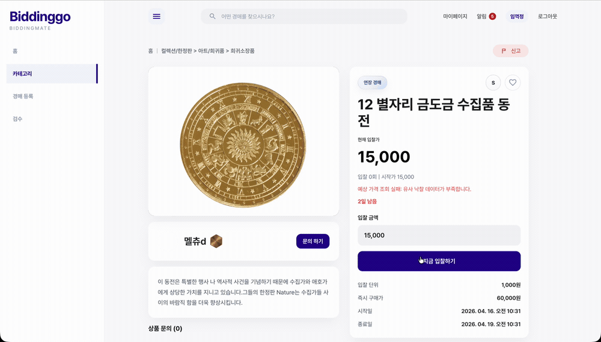
    

  

  

    
낙찰 프로세스

    <ul>
       
      <li>경매 마감 직후 최고가 입찰자에게 낙찰 알림이 발송되며 구매자와 판매자의 마이페이지 내역에 각각 거래 정보가 즉시 등록되는 것을 확인합니다.</li>
    </ul>
    

      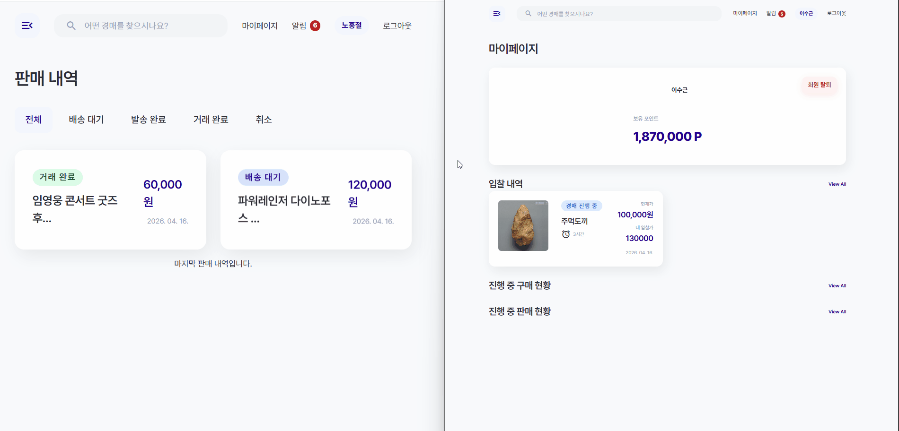
    

  

  

    
즉시 구매

    <ul>
       
      <li>즉시 낙찰 가능 경매에서 낙찰을 진행하고 구매 내역에 즉시 등록되는 것을 확인합니다.</li>
    </ul>
    

      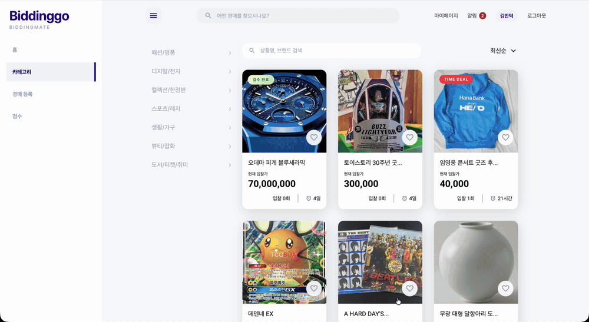
    

  

   

    
경매 문의 답변 등록 - 상세페이지

    <ul>
       
      <li>상품 상세페이지에서 직접 문의를 등록하고 동일한 페이지에서 즉시 답변을 작성하여 소통합니다.</li>
    </ul>
    

      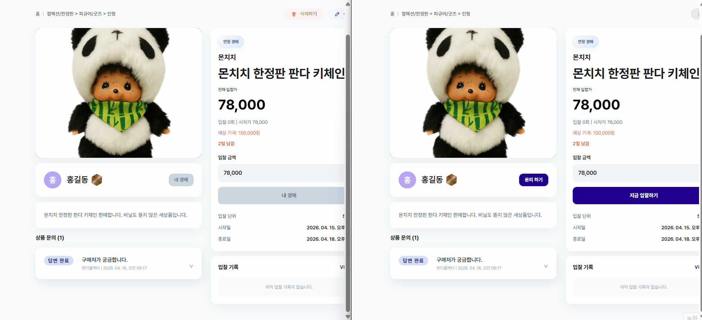
    

  

  

    
경매 문의 답변 등록 - 마이페이지

    <ul>
       
      <li>상세페이지에서 등록된 문의를 마이페이지에서 통합 조회하고 편리하게 답변을 등록하여 관리합니다.</li>
    </ul>
    

      
    

  

   

    
입찰 프로세스 (1)

    <ul>
       
      <li>보유 포인트 초과 입찰 시 에러 메시지를 확인하고 잔액 범위 내 입찰 성공 후 포인트 차감 및 상세·마이페이지 내역 반영을 확인합니다.</li>
    </ul>
    

      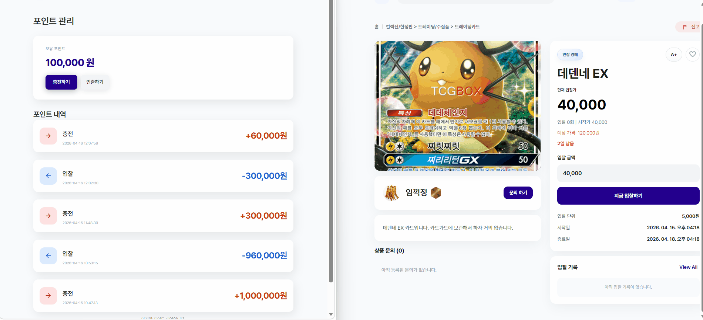
    

  

   

    
입찰 프로세스 (2)

    <ul>
       
      <li>동일한 경매에 재입찰 시 기존 입찰금을 제외한 추가 차액만큼만 포인트가 차감되는 결제 로직을 확인합니다.</li>
    </ul>
    

      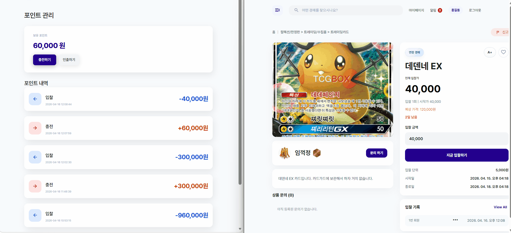
    

  

   

    
마이페이지 조회

    <ul>
       
      <li>대시보드, 입찰·구매·판매 내역, 관심 경매, 경매 관리 및 문의 내역까지 사용자의 모든 활동 데이터를 한눈에 확인하고 관리합니다.</li>
    </ul>
    

      
    

  

  

    
포인트 충전

    <ul>
       
      <li>충전 금액 입력 및 가상계좌 발급 후 토스 개발자 센터를 통한 입금 처리와 포인트 내역 반영까지의 전 과정을 확인합니다.</li>
    </ul>
    

      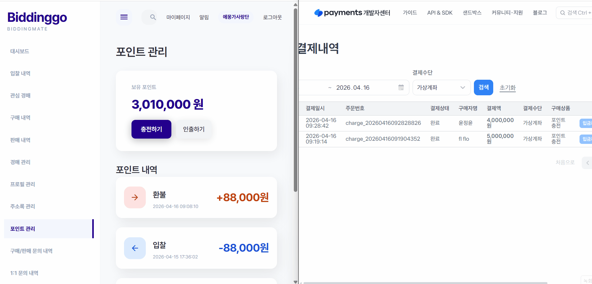
    

  

  

    
포인트 인출

    <ul>
       
      <li>보유 포인트를 인출 신청하고 포인트 이용 내역에 인출 정보가 즉시 업데이트되는 것을 확인합니다.</li>
    </ul>
    

      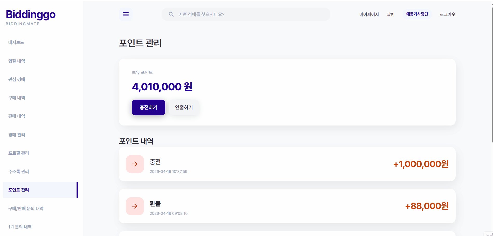
    

  

   

    
1대1 문의

    <ul>
       
      <li>문의 필수값 검증 후 등록을 완료하고 관리자 페이지의 답변 등록을 거쳐 사용자가 최종 답변을 확인하는 전 과정을 시연합니다.</li>
    </ul>
    

      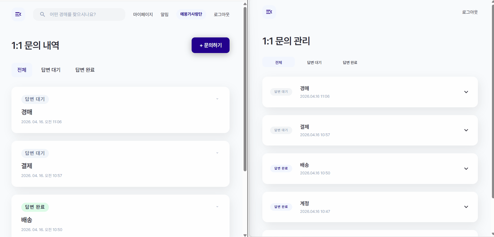
    

  

  

    
탈퇴

    <ul>
       
      <li>마이페이지에서 회원 탈퇴를 진행하고 이후 기존 계정으로 로그인이 불가능한 상태가 되는 것을 확인합니다.</li>
    </ul>
    

      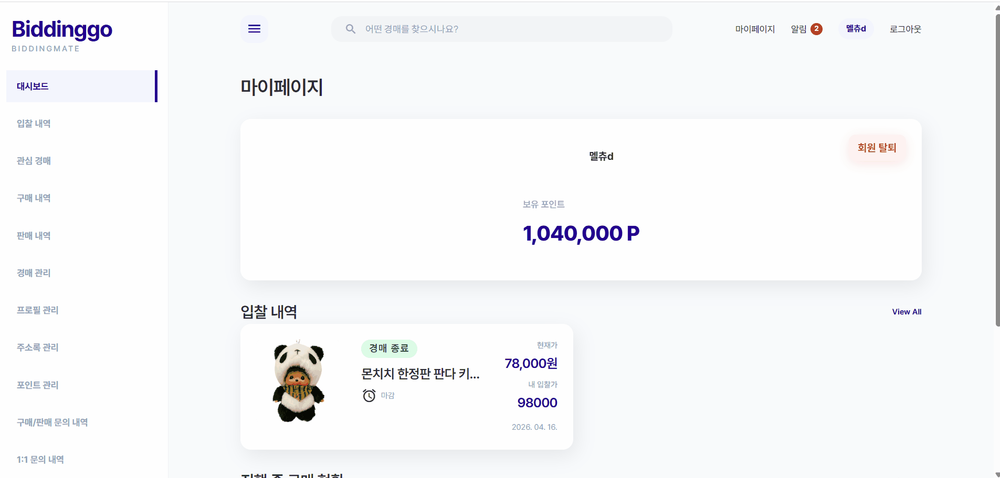
    

  

  

    
낙찰 이후 배송지 정보 등록

    <ul>
       
      <li>구매자의 배송지 입력과 판매자의 운송장 정보 등록 후 구매자 화면에서 '구매 확정' 버튼이 활성화되는 단계별 거래 흐름을 확인합니다.</li>
    </ul>
    

      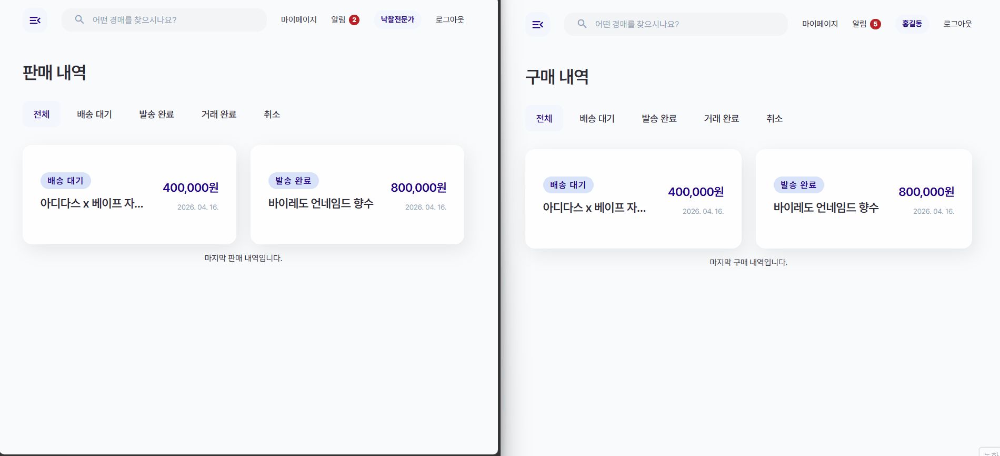
    

  

  

    
낙찰 이후 구매 확정 및 리뷰

    <ul>
       
      <li>구매 확정 및 리뷰 작성을 진행하며 판매자의 대금 정산 확인과 판매자 프로필에 리뷰가 즉시 반영되는 통합 프로세스를 확인합니다.</li>
    </ul>
    

      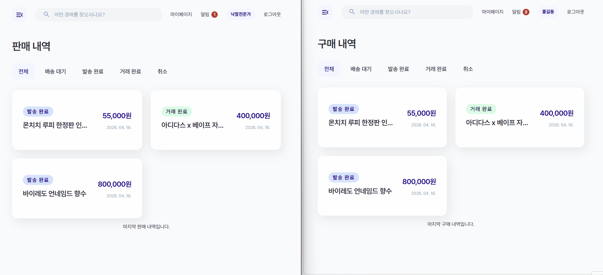
    

  

  

    
프로필 수정

    <ul>
       
      <li>닉네임, 계좌번호, 이미지 등 개인 정보를 자유롭게 수정하고 관리할 수 있으며 닉네임은 첫 1회 변경 이후 30일 뒤에 재수정이 가능합니다.</li>
    </ul>
    

      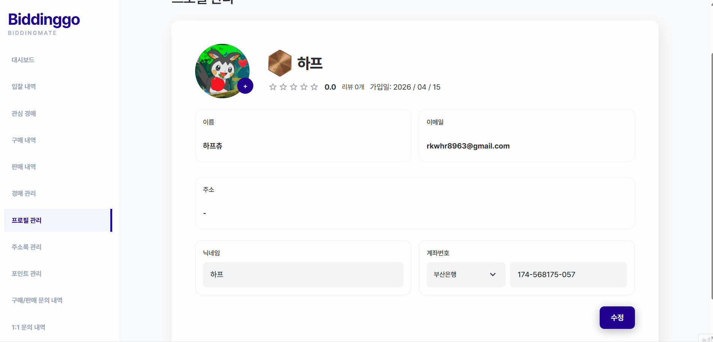
    

  

  

    
배송지 관리

    <ul>
       
      <li>배송지 추가/삭제 및 기본 배송지 설정을 통해 편리한 주소록 관리가 가능합니다.</li>
    </ul>
    

      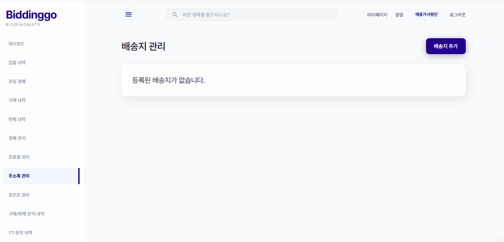
    

  

 

    
사용자 관리 [관리자]

    <ul>
       
      <li>관리자 페이지에서 특정 계정을 비활성화하여 접근을 차단하고 필요 시 다시 복귀시켜 정상적인 서비스 이용을 가능하게 합니다.</li>
    </ul>
    

      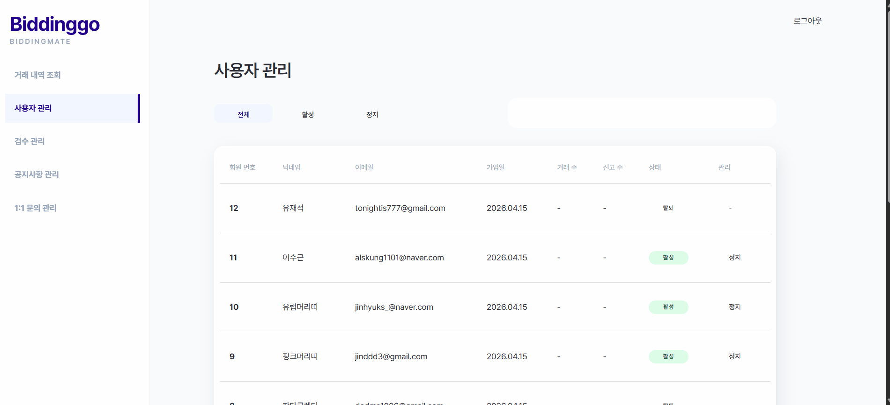
    

  

  
  

    
공지사항 추가 [관리자]

    <ul>
       
      <li>필수값 입력 검증 후 공지사항을 등록하며 등록과 동시에 모든 사용자에게 실시간 알림이 전송되는 것을 확인합니다.</li>
    </ul>
    

      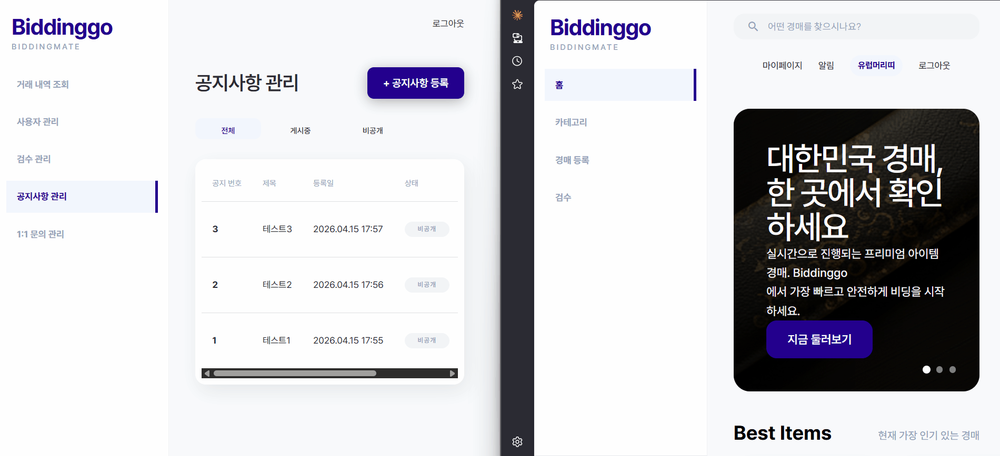
    

  

  

    
Admin 로그인 [관리자]

    <ul>
       
      <li>아이디 및 비밀번호 필수값 입력 검증을 거쳐 관리자 전용 대시보드에 안전하게 접속합니다.</li>
    </ul>
    

      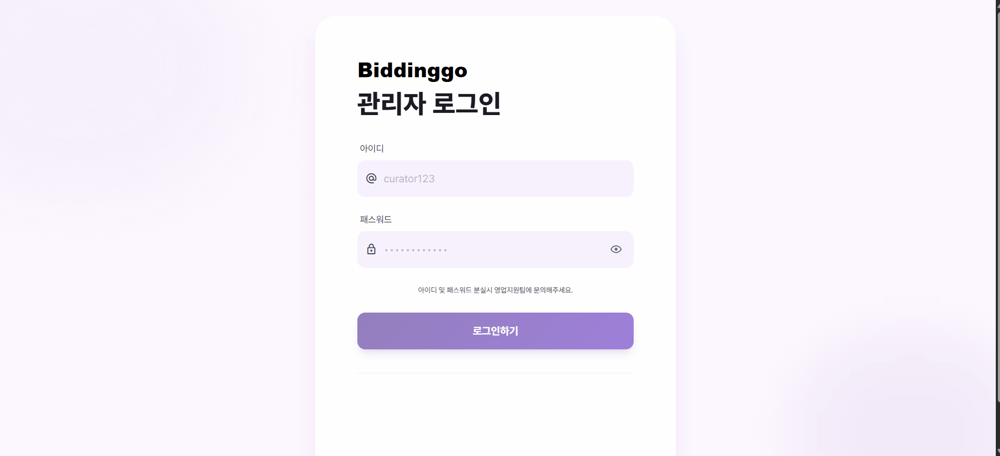
    

  

  

    
Admin 로그아웃 [관리자]

    <ul>
       
      <li>사용 중인 관리자 세션을 안전하게 종료하고 메인 화면으로 돌아갑니다.</li>
    </ul>
    

      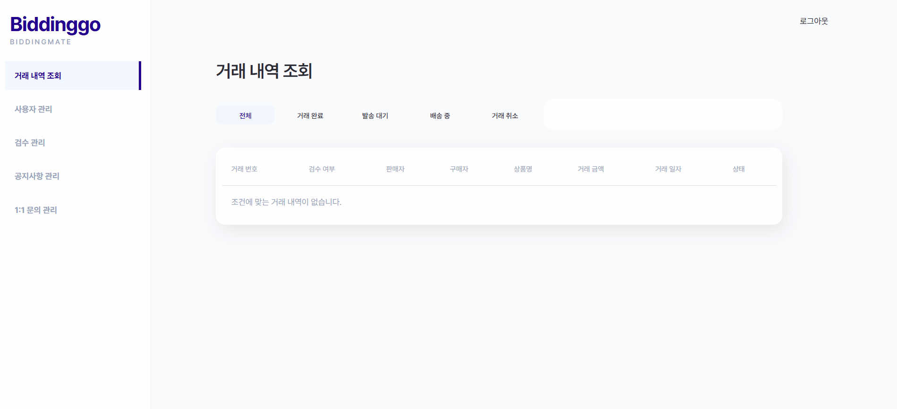
    

  

---

# 4.  회고
 

#### 김진혁
> 작성
 
#### 박선우
> 작성

#### 윤정윤
> 작성

#### 이민경
> 작성

#### 이애은
> 작성

#### 한규진
> 작성

